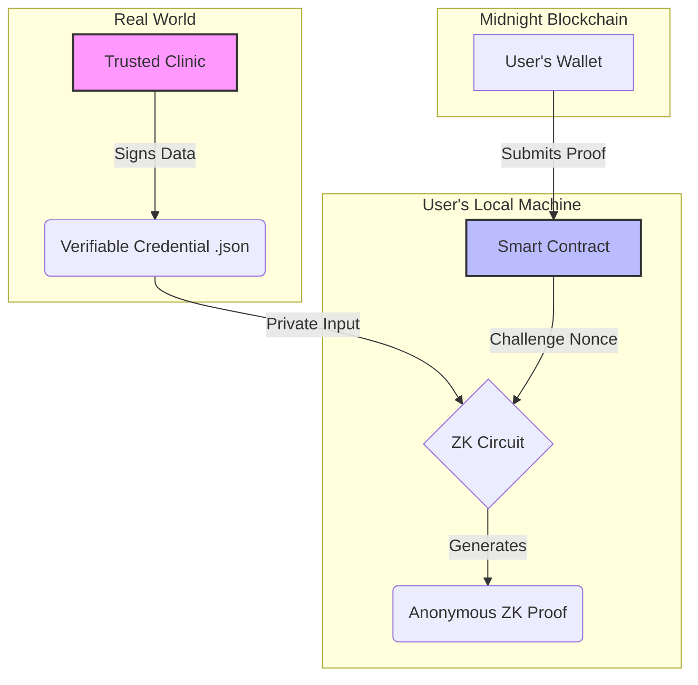
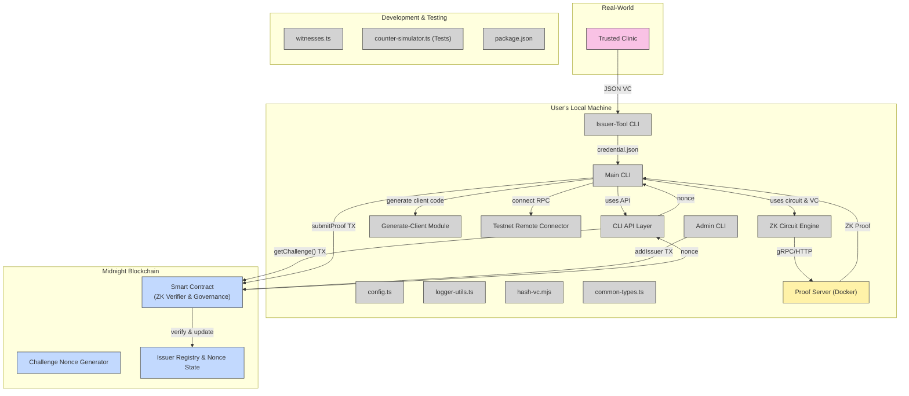

# ZK-VCR: A Verifiable Credential Oracle for Private Health Scoring

[](https://opensource.org/licenses/Apache-2.0)
[](https://www.midnight.network/)
[](https://github.com/SarthakB11/zk-vcr)

**ZK-VCR is a decentralized application built for the Midnight Network "Privacy First" Challenge. It pioneers a new standard for privacy in on-chain transactions, allowing users to prove they meet specific health criteria without ever revealing their underlying personal health information.**

---

### The Story of a Broken System: The "Leaky Bucket" of Personal Data

In the modern digital world, our data is our most valuable and vulnerable asset. Every time we apply for a service—be it insurance, finance, or social media—we are asked to hand over our private information. We send our sensitive documents to centralized servers, where they are seen by employees, stored in databases, and analyzed by third-party services.

This is the **"Leaky Bucket" model of data privacy**. Each new service we use is another hole punched in our bucket, spilling our data across the internet. We are forced to trust dozens of companies to protect our information, and as countless data breaches have shown, this trust is often broken. The result is a system where we must choose between accessing valuable services and maintaining our fundamental right to privacy.

### Our Solution: The "Airlock" Model

ZK-VCR is designed to fix this broken system. We've created an **"Airlock" model** that stops the uncontrolled spread of data. Our philosophy is simple but powerful: **Privacy for the User, Transparency for the Algorithm, and Governance for the Source.**

1.  **Privacy for the User:** A user's sensitive data **never leaves their device**. We bring the computation to the data, not the other way around.
2.  **Transparency for the Algorithm:** The rules and logic used to make decisions (our "AI" model) are published on-chain, making them fully transparent and auditable.
3.  **Governance for the Source:** The system's trust is not blind. An on-chain **Trusted Issuer Registry** ensures that data can only originate from vetted, real-world sources, governed by the DApp ecosystem.

Our project demonstrates that it's possible to build systems that are both trustworthy and private, allowing users to access services without surrendering their data sovereignty.

### Live Demo

Here is a live recording of the ZK-VCR Command-Line Interface (CLI) in action, demonstrating the complete end-to-end flow from credential generation to on-chain private verification.

[![Watch the ZK-VCR Demo]](https://github.com/user-attachments/assets/1b93a224-a133-44aa-903a-e9bb0911e9a8)

### How It Works: The Chain of Trust

Our project creates a complete, end-to-end "chain of trust" that begins in the real world and ends with a secure, private transaction on the blockchain.

```mermaid
graph TD
    subgraph "Real World (Governed by Law & Ethics)"
        A[Trusted Clinic] -- Verifies patient ID & runs lab tests --> B(Signs authentic health data);
    end

    subgraph "User's Local Machine (Absolute Privacy)"
        C(Verifiable Credential .json) -- Private Input --> D{ZK Circuit};
        E[Smart Contract] -- Issues unique 'Challenge' --> D;
        D -- Generates Proof of: 1. Signature Validity 2. Health Score 3. Challenge Response --> F(Anonymous ZK Proof);
    end

    subgraph "Midnight Blockchain (Public & Transparent)"
        G[User's Wallet] -- Submits ONLY the proof --> E;
        E -- Verifies Proof & Governance Rules --> H{✅ Success: Discount Granted};
    end

    style A fill:#f9f,stroke:#333,stroke-width:2px
    style E fill:#bbf,stroke:#333,stroke-width:2px
```



### Key Innovations: A Stress-Tested Architecture

Our final design is the result of a rigorous process of identifying and solving critical security flaws.

*   **Problem:** "Garbage In, Garbage Out" - How do we know the user isn't lying about their health data?
    *   **Our Solution:** We use **Verifiable Credentials**. Our ZK circuit's first job is to verify the digital signature on the credential, ensuring the data is authentic and untampered with.

*   **Problem:** The "Oracle Problem" - How do we trust the real-world clinic that issues the credential?
    *   **Our Solution:** We use an **On-Chain Trusted Issuer Registry**. Our smart contract acts as a gatekeeper, only accepting proofs that originate from a clinic on its publicly governed list.

*   **Problem:** "Replay Attacks" - How do we stop a user from re-using an old, valid proof?
    *   **Our Solution:** We implement a **Nonce-based Challenge-Response Mechanism**. The smart contract issues a unique, single-use "challenge" for every transaction, which must be included in the proof, ensuring it is fresh and cannot be replayed.

---

### Tutorial: Getting Started with ZK-VCR

This tutorial will guide you through setting up your environment and running the complete end-to-end demo.

<details>
<summary><strong>▶️ Click to expand the full, step-by-step tutorial.</strong></summary>

<!-- The entire content of tutorial.md is imported here -->

# ZK-VCR: A Step-by-Step Tutorial

Welcome to the ZK-VCR tutorial. This guide will walk you through the entire process of setting up, running, and understanding our "Privacy First" DApp.

### 1. Introduction: What is ZK-VCR?

ZK-VCR (Verifiable Credential Oracle) is a decentralized application that allows a user to prove they meet a specific health requirement (e.g., "low cardiovascular risk") to an on-chain smart contract, without revealing any of their underlying personal health information.

It achieves this by creating a "chain of trust" that combines the real-world authenticity of **Verifiable Credentials**, the mathematical integrity of **Zero-Knowledge Proofs**, and the transparent logic of an **on-chain AI model**.

Here is a high-level overview of the ZK-VCR architecture:



<details>
<summary><strong>Click to expand: Understanding the Core Concepts & Our "Privacy First" Guarantee</strong></summary>

#### The "Privacy Firewall": Isolating the Point of Disclosure

The revolutionary idea here is not that your data is never seen by *anyone*. It's that we **control and isolate the point of disclosure** and prevent it from spreading any further.

*   **The World Today (The "Leaky Bucket" Model):** You go to a clinic, they have your data. You then send that data to your insurance company, to analytics services, and so on. Your data privacy is a leaky bucket, spilling out at every step.

*   **Our ZK-VCR Project (The "Airlock" Model):**
    1.  You go to a **single, trusted clinic**. This is the **one and only point of disclosure**, governed by real-world laws like doctor-patient confidentiality.
    2.  The clinic acts as a **Privacy Firewall**, translating your real-world health status into a secure, signed Verifiable Credential.
    3.  **The Airlock Shuts.** From this point forward, your data enters our purely private digital ecosystem. You use our DApp to generate a ZK proof.
    4.  The insurance company's smart contract **NEVER SEES YOUR DATA.** It only sees the anonymous proof. It learns only one single, binary fact: "This anonymous person qualifies for the discount."

Your data is secured from **everyone *except* the clinic you explicitly choose to trust.** We stop the uncontrolled spread of data across the internet.

</details>

---

### 2. Prerequisites & System Setup

Before running the project, you need to set up your development environment correctly.

<details>
<summary><strong>Click to expand: Detailed Step-by-Step Environment Setup Guide</strong></summary>

This is the "Golden Path" from a fresh start to a perfectly configured environment. Follow these instructions in order inside a WSL/Ubuntu terminal.

#### **Phase A: System Prerequisites**

Ensure the following are installed and running on your Windows machine:
1.  **WSL (Ubuntu):** The Windows Subsystem for Linux.
2.  **Docker Desktop:** Must be installed and running.

#### **Phase B: Configure the WSL/Ubuntu Environment**

1.  **Open a Fresh WSL Terminal:** Go to your Windows Start Menu, search for "Ubuntu" or "WSL", and open it.

2.  **Install Essential Tools:**
    ```bash
    sudo apt update
    sudo apt install -y git curl
    ```

3.  **Install NVM (Node Version Manager):**
    ```bash
    curl -o- https://raw.githubusercontent.com/nvm-sh/nvm/v0.39.7/install.sh | bash
    ```

4.  ⚠️ **Important:** Close and Re-open Your WSL Terminal. This is required to activate NVM.

5.  **Install and Set Node.js:**
    ```bash
    nvm install 18
    nvm alias default 18
    ```
    Verify with `node --version`. It should show a v18.x.x version.

6.  **Install the Compact Compiler:**
    *   Using your **Windows browser**, download the latest **Linux** version from the [Midnight Testnet releases repository](https://github.com/Midnight-Network/testnet-releases/releases). It will be named `compactc-linux.zip`.
    *   **In your WSL terminal**, run the following commands. **Replace `<YourWindowsUsername>`** with your actual Windows username.
        ```bash
        # Create a permanent home for the compiler
        mkdir -p ~/my-binaries/compactc
        
        # Copy the downloaded file from Windows to WSL
        cp /mnt/c/Users/<YourWindowsUsername>/Downloads/compactc-linux.zip ~/my-binaries/compactc/
        
        # Unzip the compiler
        cd ~/my-binaries/compactc
        unzip compactc-linux.zip
        
        # Make it executable
        chmod +x compactc compactc.bin zkir
        ```

7.  **Add the Compiler to Your `PATH`:**
    *   Get the full path to your compiler by running `pwd` inside the `~/my-binaries/compactc` directory. Copy the output.
    *   Open your shell configuration file: `nano ~/.bashrc`
    *   Scroll to the very bottom and add these two lines, **pasting the path you just copied**:
        ```bash
        # Replace the path with your actual path from the pwd command
        export COMPACT_HOME='/home/YOUR_USERNAME/my-binaries/compactc'
        export PATH="$COMPACT_HOME:$PATH"
        ```
    *   Save and Exit (`Ctrl+O`, `Enter`, `Ctrl+X`).

8.  ⚠️ **Important:** Close and Re-open Your WSL Terminal.

9.  **Final Environment Check:** In your new terminal, run:
    ```bash
    compactc --version
    ```
    ✅ **Success!** You must see the compiler's version number. If you do, your environment is perfect.

</details>

---

### 3. Getting Started: Download and Build the Project

With your environment configured, you can now download and build ZK-VCR.

1.  ⌨️ **Your Action:** **Clone the Repository:**
    ```bash
    # Make sure you are in your home directory
    cd ~
    git clone https://github.com/SarthakB11/zk-vcr.git
    ```

2.  ⌨️ **Your Action:** **Navigate to the Project Directory:**
    ```bash
    cd zk-vcr
    ```

3.  ⌨️ **Your Action:** **Install All Dependencies:**
    ```bash
    npm install
    ```
    This command will install dependencies for all sub-projects (`contract`, `cli`, etc.).

4.  ⌨️ **Your Action:** **Compile the Smart Contract and ZK Circuit:**
    ```bash
    # Navigate to the contract directory
    cd contract
    
    # Compile the .compact files
    npm run compact && npm run build
    ```    ✅ **Success!** You should see the compiler output without any errors.

5.  ⌨️ **Your Action:** **Build the CLI Applications:**
    ```bash
    # Navigate to the CLI directory
    cd ../cli
    
    # Build the TypeScript code
    npm run build
    ```    You are now ready to run the end-to-end demo.

---

### 4. Running the End-to-End Demo

[![Watch the ZK-VCR Demo]](https://github.com/user-attachments/assets/1b93a224-a133-44aa-903a-e9bb0911e9a8)

This process demonstrates the three distinct roles in our system: the **Issuer**, the **Administrator**, and the **User**. This requires **two separate WSL terminals**.

#### **Step 1: Start the Proof Server (Terminal 1)**

⚠️ **Important:** Do NOT close this terminal while the DApp is running.

1.  Open a **NEW** WSL terminal window.
2.  Run the Docker command to start the Midnight Proof Server:
    ```bash
    docker run -p 6300:6300 midnightnetwork/proof-server -- 'midnight-proof-server --network testnet'
    ```
3.  **Leave this terminal running.** It handles all the heavy cryptographic work.

#### **Step 2: The Issuer's Role: Generate a Credential (Terminal 2)**

Before a user can prove their health status, they must receive a signed credential from a trusted clinic. We simulate this with our `issuer-tool`.

1.  Go back to your **original** WSL terminal (it should be in the `/cli` directory).
2.  ⌨️ **Your Action:** Run the Issuer Tool:
    ```bash
    npm run issuer-tool
    ```
3.  Follow the interactive prompts:
    *   **Enter Clinic's Private Key:** This is a secret 32-byte key. You can use this example: `1122334455667788112233445566778811223344556677881122334455667788`
    *   **Enter Patient Data:** Provide health metrics. To test the "success" path, enter data that qualifies as "Low Risk" (e.g., Cholesterol: `150`, Blood Pressure: `120`, Smoker: `false`).
    *   **Enter Filename:** Name the output file `credential.json`.
4.  📝 **Note:**
    *   A `credential.json` file is created in the `/cli` directory. This is the Verifiable Credential.
    *   The tool will display the clinic's **Issuer Public Key**. **Copy this public key now**, you will need it in the next step.

#### **Step 3: The Admin & User Roles: Run the Main CLI (Terminal 2)**

Now we run the main application to deploy the contract and use the credential.

1.  ⌨️ **Your Action:** **Start the Main CLI:**
    ```bash
    npm run start-testnet-remote
    ```
2.  **Wallet Setup:** The CLI will start. Choose an option to set up your general-purpose wallet (e.g., **Option 2** to build from a seed). This wallet is for submitting transactions and paying fees.
3.  **The Administrator Flow:**
    *   At the main menu, select **Option 2 (DApp Administrator)**. This enters the secure admin panel.
    *   Choose **Option 1 (Deploy)** and provide a **secret key for the contract owner**. This key is the "master key" for your DApp.
    *   The contract will be deployed. 📝 **Note: Copy the new Contract Address.**
    *   Now, back in the admin menu, choose **Option 1 (Add an issuer)**.
    *   **Paste the Issuer Public Key** you copied from the Issuer Tool. This tells the smart contract to trust credentials signed by that clinic.
4.  **The User Flow:**
    *   Return to the main menu by choosing **Option 4**. Now, select **Option 1 (User)**.
    *   **Enter the Contract Address** you just copied from the deployment step.
    *   **Enter Credential Path:** `./credential.json`
    *   The CLI will automatically get a challenge from the contract, generate the ZK proof locally, and submit it.
5.  **Verification:**
    *   ✅ **Success!** You should see a "Verification Successful!" message.
    *   To be certain, you can go back to the **Administrator Flow** (you will need to re-enter the owner's secret key for authentication) and **Display the contract state**. You will see that the `usedNonces` map has been updated, providing on-chain evidence of your successful, private verification.


Congratulations! You have successfully run the entire ZK-VCR workflow, acting as all three participants in a secure, privacy-preserving ecosystem.

</details>

### Troubleshooting

<details>
<summary><strong>▶️ Click to expand: Common Issues & Solutions.</strong></summary>

<!-- The entire content of faq.md is imported here -->
# ZK-VCR CLI: Frequently Asked Questions & Troubleshooting

This guide provides solutions to common errors you might encounter while using the ZK-VCR command-line interface. Understanding these errors can help you diagnose issues with the smart contract, your local setup, or the data you are providing.

---

### 1. `failed assert: Caller is not the owner`

*   **❓ What it means:** You are trying to perform an action that is restricted to the DApp administrator (like adding or revoking a clinic), but you have not authenticated with the correct "master key" for the smart contract.

*   **🤔 Why it happens:** The smart contract has a security check to ensure that only the original deployer (the owner) can manage the list of trusted clinics. The secret key you provided in the administrator panel does not match the one associated with the owner's address stored on-chain.

*   **🔁 How to reproduce the error:**
    1.  Start the CLI and select **Option 2 (DApp Administrator)**.
    2.  Choose **Option 2 (Join an existing contract)** and enter a valid contract address.
    3.  When prompted for the `contract owner secret key`, deliberately enter a **wrong** 64-character hex key.
    4.  The CLI will let you in (as it can't verify the key until you try to make a change).
    5.  Choose **Option 1 (Add an issuer)**. The transaction will be sent, but the smart contract will reject it, and you will see this error.

*   **✅ How to fix it:** Ensure you are using the **exact same secret key** that was used when the contract was originally deployed. If you have lost the owner's secret key, you have lost administrative control of that specific contract instance and will need to deploy a new one.

---

### 2. `failed assert: Issuer key not found in registry`

*   **❓ What it means:** You are trying to submit a health proof as a user, but the credential you are using was signed by a clinic that the smart contract does not recognize as a trusted source.

*   **🤔 Why it happens:** The DApp administrator has not yet added the clinic's public key to the on-chain `trustedIssuers` list. The smart contract is correctly rejecting data from an unknown, untrusted source.

*   **🔁 How to reproduce the error:**
    1.  Use the `issuer-tool` to generate a new `credential.json` file and get a new clinic's public key.
    2.  As the **DApp Administrator**, deploy a new contract.
    3.  **Crucially, skip the "Add an issuer" step.**
    4.  Switch to the **User** flow and try to submit a proof using the `credential.json` you just created. The contract will not recognize the issuer's key, and the assertion will fail.

*   **✅ How to fix it:** The DApp administrator must use their owner key to log into the admin panel and call the `addIssuer` function, providing the public key of the clinic that signed the credential.

---

### 3. `failed assert: Challenge nonce has already been used`

*   **❓ What it means:** The proof you submitted is valid, but it uses a "challenge" nonce that has already been used in a previous successful transaction. This is the contract's replay protection working correctly.

*   **🤔 Why it happens:** Each proof must be tied to a unique, single-use challenge provided by the contract to prevent a malicious actor from intercepting a valid proof and re-submitting it.

*   **🔁 How to reproduce the error:** This error is difficult to reproduce with the current CLI because the `userFlow` is designed to *always* fetch a fresh challenge before submitting a proof. You would only encounter this if you were manually crafting transactions and deliberately re-used an old challenge value.

*   **✅ How to fix it:** No action is needed from the user. The CLI automatically handles getting a fresh challenge for every proof submission. This error signifies that the security system is working as intended.

---

### 4. `Error: connect ECONNREFUSED 127.0.0.1:6300`

*   **❓ What it means:** The ZK-VCR CLI cannot connect to the Midnight Proof Server.

*   **🤔 Why it happens:** The proof server, which runs in a Docker container, is either not running or is not accessible from your WSL terminal. This server is essential for handling the heavy cryptographic computations of ZK proof generation.

*   **🔁 How to reproduce the error:**
    1.  Ensure the proof server Docker container is **not** running.
    2.  Start the main CLI using `npm run start-testnet-remote`.
    3.  Attempt any action that requires generating a proof (like `submitHealthProof` or even `deploy`). The connection will fail, and this error will appear.

*   **✅ How to fix it:**
    1.  Make sure Docker Desktop is installed and running on your host machine.
    2.  In a separate terminal, run the command from the tutorial to start the proof server: `docker run -p 6300:6300 midnightnetwork/proof-server -- 'midnight-proof-server --network testnet'`
    3.  Leave this terminal running in the background while you use the main CLI.

---

### 5. `Error: Failed to join contract.`

*   **❓ What it means:** The CLI could not find a contract at the address you provided.

*   **🤔 Why it happens:** This is usually caused by a typo in the contract address or trying to connect to a contract that doesn't exist on the current network.

*   **🔁 How to reproduce the error:**
    1.  Start the CLI and enter the **User** or **Administrator** flow.
    2.  When prompted to enter a contract address, type in any random 64-character hex string that is not a real contract address.
    3.  The CLI will attempt to query the indexer for this address and will fail when it finds nothing.

*   **✅ How to fix it:** Carefully copy and paste the exact contract address that was output when the contract was deployed. Ensure there are no extra spaces or missing characters.

</details>

### Technical Deep Dive

For those interested in the specific implementation details, the project's development was broken down into a series of well-documented phases. Each phase represents a major step in the development process, from the initial smart contract skeleton to the final, polished user interface.

You can review the code and detailed descriptions for each phase at the following links:

*   **[Phase 1: Smart Contract Skeleton](https://github.com/SarthakB11/zk-vcr/commit/d920b19711074c47ee4e70dfbd84f33dd4d96255)**: Details the implementation of the on-chain governance and security model.
*   **[Phase 2: Core ZK Logic](https://github.com/SarthakB11/zk-vcr/pull/1)**: Explains the implementation of the ZK circuits for signature verification and the AI model.
*   **[Phase 3: Off-Chain Tooling](https://github.com/SarthakB11/zk-vcr/pull/2)**: Covers the development of the issuer tool and the initial user CLI.
*   **[Phase 4: Final UX & Security Hardening](https://github.com/SarthakB11/zk-vcr/pull/3)**: Details the final CLI enhancements and the implementation of the challenge-response mechanism.

### Academic & Industry Foundations

The concepts in this project are built upon foundational research in cryptography and decentralized identity. Our work is a practical implementation of the principles described in the following papers and standards:

1.  **Zero-Knowledge Proofs:**
    *   Parno, B., Gentry, C., Howell, J., & Raykova, M. (2016). *Pinocchio: Nearly practical verifiable computation*. Communications of the ACM, 59(2), 103-112. - A seminal paper on practical ZK-SNARKs, which form the basis of Midnight's technology.
2.  **Verifiable Credentials:**
    *   W3C. (2022). *Verifiable Credentials Data Model v1.1*. W3C Recommendation. - The official industry standard for the data model that our `credential.json` is based on. [Read the specification here](https://www.w3.org/TR/vc-data-model/).
3.  **The Oracle Problem:**
    *   Chainlink. *"What Is the Blockchain Oracle Problem?"*. - A comprehensive industry overview of the challenge of bringing real-world data onto the blockchain, which our project directly addresses. [Read the article here](https://chain.link/education/blockchain-oracles).
4.  **Articles:**
    *   **[The Cost of a Data Breach Report 2023](https://www.ibm.com/reports/data-breach)** - This annual report from IBM is the gold standard for quantifying the financial impact of data breaches. It consistently finds that the healthcare industry suffers the most expensive breaches, averaging **$10.93 million per incident**. This report provides the core economic justification for building systems like ZK-VCR.
    *   **[HCA Healthcare says data of 11 million patients stolen in breach](https://www.reuters.com/technology/hca-healthcare-says-data-11-mln-patients-stolen-2023-07-10/)** - A Reuters article detailing one of the largest healthcare breaches of 2023. This serves as a concrete example of the "Leaky Bucket" model in action, where a single, centralized entity becomes a massive target, exposing millions of sensitive patient records.
    *   **[23andMe says hackers stole ancestry data on 6.9 million users](https://techcrunch.com/2023/12/04/23andme-confirms-hackers-stole-ancestry-data-on-6-9-million-users/)** - This TechCrunch story highlights the new frontier of data privacy: genetic information. It underscores the danger of breaches involving immutable, lifelong data and demonstrates the need for privacy-preserving ways to use this data for research or personalized medicine.
    *   **[HIPAA Journal: November 2023 Healthcare Data Breach Report](https://www.hipaajournal.com/november-2023-healthcare-data-breach-report/)** - This report from the HIPAA Journal provides a sense of the alarming scale and frequency of the problem. It shows that dozens of breaches affecting millions of records occur *every single month*, proving that this is a systemic, ongoing failure, not an isolated event.
### Technology Stack

*   **Blockchain:** Midnight Testnet
*   **Smart Contracts & ZK Circuits:** Compact DSL
*   **Client-Side Applications:** Node.js, TypeScript
*   **Blockchain Interaction:** `MidnightJS`
*   **Cryptography & Hashing:** `@midnight-ntwrk/compact-runtime`, `ethers.js`
*   **Proof Generation:** Midnight Proof Server (Docker)
*   **CLI Enhancements:** `chalk`, `inquirer`, `ora`

### Detailed Repository Diagram



### Future Work

While ZK-VCR is a complete end-to-end DApp, this architecture opens the door for exciting future possibilities:

*   **Web Interface:** Building a full-fledged React web application using `MidnightJS` to provide a graphical user experience.
*   **Advanced AI Models:** Integrating more complex, but still ZK-friendly, models like decision trees or logistic regression for more nuanced risk scoring.
*   **Decentralized Governance:** Migrating the `owner` role of the smart contract to a DAO, allowing the community to vote on which issuers to trust.

### License

This project is open-source and licensed under the [Apache License 2.0](./LICENSE).

### Acknowledgements

We would like to thank the Midnight Foundation and the DEV Community for organizing the "Privacy First" Challenge and providing the tools and platform to build the future of decentralized, privacy-preserving applications.

