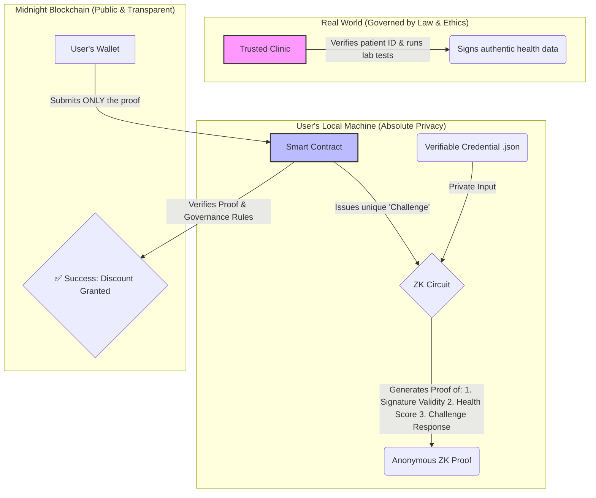

### How It Works: The Chain of Trust

Our project creates a complete, end-to-end "chain of trust" that begins in the real world and ends with a secure, private transaction on the blockchain.

```mermaid
graph TD
    subgraph "Real World (Governed by Law & Ethics)"
        A[Trusted Clinic] -- Verifies patient ID & runs lab tests --> B(Signs authentic health data);
    end

    subgraph "User's Local Machine (Absolute Privacy)"
        C(Verifiable Credential .json) -- Private Input --> D{ZK Circuit};
        E[Smart Contract] -- Issues unique 'Challenge' --> D;
        D -- Generates Proof of: 1. Signature Validity 2. Health Score 3. Challenge Response --> F(Anonymous ZK Proof);
    end

    subgraph "Midnight Blockchain (Public & Transparent)"
        G[User's Wallet] -- Submits ONLY the proof --> E;
        E -- Verifies Proof & Governance Rules --> H{✅ Success: Discount Granted};
    end

    style A fill:#f9f,stroke:#333,stroke-width:2px
    style E fill:#bbf,stroke:#333,stroke-width:2px
```
